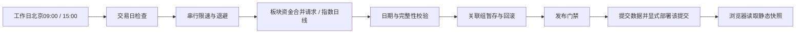

# A 股市场快照看板

原生 JavaScript + Vite 静态站点；前端只读取静态 JSON，不直接请求行情供应商。

## 功能

| 页面 | 内容 |
|---|---|
| 市场洞察 | 市场温度、资金排行、强弱板块；只合并同日期同批次数据 |
| 大盘走势 | 上证、深成、创业板日 K / 周 K；不再采集或展示分时 |
| 资金流向 | 行业与概念资金排行 |
| 板块分析 | 行业、概念、地域全分页列表 |

## 采集策略



| 配置 | 行为 |
|---|---|
| 时间 | 北京时间 09:00、15:00；GitHub Actions 定时触发可能延迟，不保证整点完成 |
| 上午 | 补采前一交易日；板块快照必须在 09:15 前完成，否则保留旧值 |
| 下午 | 抓取当日快照，标记 provisional，不冒充最终收盘数据 |
| 休市 | 跳过周末及配置的休市日；未知年份拒绝采集，需维护日历 |
| 指数来源 | 腾讯 → 新浪 → 东方财富；请求或内容校验失败均尝试降级 |
| 板块与资金 | 东方财富同次全分页响应拆分生成，避免重复采集与批次混用 |
| 周线 | 从同源日线聚合，丢弃最早可能不完整周，最多保留 52 周 |
| 请求 | 同供应商间隔 10–20 秒，超时 20 秒，最多 3 次尝试 |
| 退避 | 60 / 180 秒加随机抖动；尊重 Retry-After；拒绝访问或持续限流熔断 |
| 失败 | 保留该关联组旧数据，发布失败状态；成功组可独立更新 |
| 历史 | 板块与资金按交易日期归档，保留约 30 个自然日；同日补采覆盖暂定版 |

免费公开接口不等于有稳定性或授权保障；当前没有声称板块资金存在独立可靠备用源。
不会通过轮换 IP、密集并发或换域名规避限流。

## 数据一致性

- schemaVersion=2 记录 dataDate、updatedAt、source、batchId、freshness。
- verified 表示上午目标日期检查通过，不代表数据供应商正式认证。
- 已有目标日期 verified 的完整组不重复抓取；不依赖文件修改时间判断新鲜度。
- 板块校验分页 total、重复代码、源时间戳和数值；缺页或跨补采窗口则整组丢弃。
- 指数校验日期、OHLC、成交量与目标日期；成交量保留源原始单位，切源不宜直接比较。
- 单组写入出错回滚；站点整体一致性以 Git 提交和 Pages 部署产物为边界。
- status.json 记录运行状态及各组实际日期；未结束批次禁止发布。
- 旧格式整组可暂时展示并标记；洞察页在相关数据升级到同批次前暂停合并分析。
- 页面每 30 分钟及重新可见时刷新静态文件，不新增供应商请求。

## 目录

| 路径 | 用途 |
|---|---|
| fetch-data.cjs | 时段、目标日期、采集编排、状态输出 |
| scripts/data/calendar.cjs | 北京时间及交易日历 |
| scripts/data/http.cjs | 限速、超时、重试、熔断 |
| scripts/data/sources.cjs | 数据源、分页、字段校验、周线聚合 |
| scripts/data/storage.cjs | 关联组写入与历史清理 |
| scripts/data/check-publication.cjs | 只读发布门禁 |
| src/ | 页面渲染与本地缓存 |
| public/data/ | 快照及历史数据 |
| .github/workflows/ | 两次采集与 Pages 发布 |

## 开发与发布

```bash
npm ci
npm run dev
npm run build
node --check fetch-data.cjs
node scripts/data/check-publication.cjs
```

需要真正更新数据时才运行 node fetch-data.cjs：该命令会请求外网并修改 public/data。
FETCH_SLOT 支持 auto、morning、afternoon；手动选择不会绕过采集时间与日期校验。

Actions 的 Update Stock Data 支持手动选择时段，仅 main 分支执行；需要仓库内容写权限。
采集后先运行发布门禁，再提交变更并显式调用部署工作流，部署固定到该次提交 SHA。
存在采集失败时，允许先部署完整旧数据和状态，再将工作流标记失败。
Pages 需使用 GitHub Actions 部署，并具备 pages:write 与 id-token:write 权限。

## 维护与限制

- 日历已配置 2025 / 2026 年；跨年前必须维护下一年休市表。
- 09:00 批次延迟到 09:15 后，板块补采会失败；指数历史仍可补采。
- 15:00 抓取可能早于源端最终结算，故始终展示暂定标记，等待下一交易日上午补采。
- 旧版遗留分时 JSON 不再被采集或展示；本次未清理既有行情文件。
- 本地构建与语法通过不代表上游联通、字段可用性或 Actions / Pages 已联调通过。

最后更新：2026-10-01
