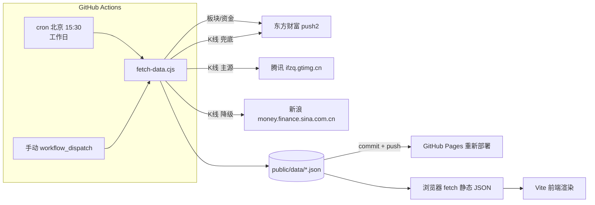

# A-share 数据分析面板

纯静态、零后端的 A 股看盘面板：GitHub Actions 定时抓取数据生成静态 JSON，GitHub Pages 托管，前端只读静态文件，永不直连行情接口（K 线降级链除外）。

- 页面：GitHub Pages 自动部署
- 数据：交易日收盘后自动更新（北京时间 15:30）
- 体积：HTML 4.8KB · JS 29.6KB（gzip 9.6KB）· CSS 18.9KB（gzip 4.7KB）

## 功能

| 页签 | 内容 |
|------|------|
| 市场洞察 | 市场温度条、主力资金净流入、强势/弱势板块 TOP5、板块轮动信号、风险提示 |
| 大盘走势 | 上证/深成/创业板 日K、周K、分时（ECharts，懒加载） |
| 资金流向 | 行业/概念主力资金流排行（超大单/大单拆分） |
| 板块分析 | 行业/概念/地域板块，支持搜索、任意列排序 |

## 架构



前端运行时**只读静态 JSON**，交易时段每 30 分钟提示刷新（重拉静态文件）；K 线因数据量原因保留客户端直连降级链。

## 数据源策略

| 数据 | 主源 | 降级 | 兜底 |
|------|------|------|------|
| K 线（日/周/分时） | 腾讯 fqkline / mkline | 新浪 CN_MarketData | 东方财富 |
| 行业/概念/地域板块 | 东方财富 push2（m:90） | — | — |
| 主力资金流 | 东方财富 push2（fid=f62） | — | — |

抓取侧防限流：请求间隔加大、502 退避重试（最多 5 次）；节假日表内置 2026 年休市日，周末与休市日自动跳过。

## 定时更新

| 配置 | 值 |
|------|-----|
| cron | `30 7 * * 1-5`（UTC）= 北京时间 15:30，周一至周五 |
| 时机 | 收盘半小时后，等数据源落定 |
| 产物 | `public/data/` 变更则自动 commit + push，触发 Pages 重新部署 |
| 手动 | Actions 页面 Run workflow（`workflow_dispatch`） |
| 历史快照 | `public/data/history/` 按日存档 |

## 技术栈

| 类别 | 选型 |
|------|------|
| 构建 | Vite 5，vanilla JS ES Modules，无框架 |
| 图表 | ECharts 5（jsDelivr CDN，用到时才加载） |
| 字体 | Space Grotesk Variable（@fontsource-variable，jsDelivr） |
| CI/CD | GitHub Actions：static.yml 部署 + update-stock-data.yml 抓数 |

## 目录结构

```
├── index.html            # 单页骨架（curtain/导航胶囊/panels 容器）
├── fetch-data.cjs        # Actions 抓数脚本（Node 22 原生 fetch）
├── src/
│   ├── main.js           # 主题、导航转场、波纹、3D 倾斜、自动刷新
│   ├── insight.js        # 市场洞察（温度/资金/轮动/风险）
│   ├── market.js         # 指数卡片 + K 线图（K线三级降级）
│   ├── capital.js        # 资金流向表
│   ├── sector.js         # 板块表（搜索/排序）
│   ├── state.js          # 共享状态
│   ├── utils.js          # countUp、格式化、骨架屏等
│   └── styles/main.css   # 设计体系 + 动画
├── public/data/          # 静态数据 JSON（Actions 生成）
│   └── history/          # 每日快照存档
└── .github/workflows/    # 部署 + 抓数两条流水线
```

## 设计体系

暖炭底 + 琥珀点缀的编辑风格，无 emoji、无模板味：

| Token | 暗色 | 亮色 |
|-------|------|------|
| 背景 | `#17161b` | `#faf8f4` |
| 强调 | `#f0b429` | `#d98e04` |
| 涨 / 跌 | `#ff6b5e` / `#3ecf8e` | 同左 |
| 字体 | Space Grotesk Variable + 系统中文栈 | 同左 |

动画全部走 transform/opacity GPU 合成层（大面积 DOM 上禁用 filter:blur），主动不响应 `prefers-reduced-motion`（远程桌面/系统关动画会误杀全部动效）：

- Tab 切换：方向感知滑入 + 导航胶囊弹簧滑动
- 数字 countUp（easeOutBack 回弹）+ 温度条生长 + 涨跌对抗条
- 卡片 3D 倾斜 + 鼠标跟随光斑 + 点击波纹 + 高光扫过
- ECharts K 线逐根级联生长，亮暗主题各自配色

## 本地开发

```bash
npm install
npm run dev      # http://localhost:5173
npm run build    # 产物在 dist/
node fetch-data.cjs   # 本地刷一遍数据（写入 public/data/）
```

## 已知限制

| 限制 | 说明 |
|------|------|
| 板块仅抓第一页 | 每类取涨幅榜前 100（全量约 496 个行业），温度与排行基于 TOP100 计算 |
| K 线指数范围 | 仅三大指数（上证/深成/创业板），个股未接入 |
| 实时性 | 收盘后每日一更，盘中不做实时推送 |

---

> 最后更新：2026-09-28
